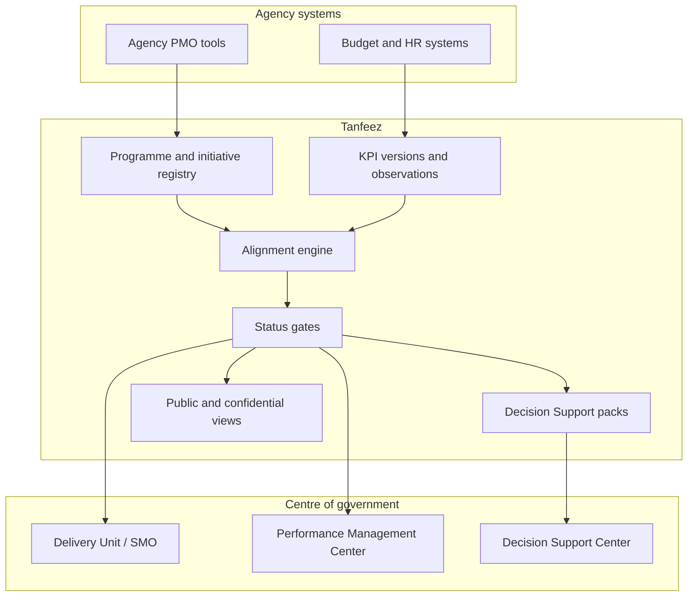

# Tanfeez

**Source:** `ai-in-gov/Saudi_Vision2030_EN/`
**Domain:** `ai-gov`
**One-liner:** A national Vision-delivery operating system that keeps every Vision 2030 executive programme, agency initiative and KPI on one alignment ledger — surfacing gaps, duplication and contradictions before they become failed promises.
**Wedge:** The Council of Economic and Development Affairs Delivery Unit, agency PMOs and the Center for Performance Management of Government Agencies coordinating the National Transformation Program and sibling Vision Realization Programs — where hundreds of initiatives must stay aligned to published 2030 goals without contradictory policies across ministries.
**Positioning:** National programme delivery control. Strategy documents and slide dashboards announce targets; Tanfeez makes *delivery alignment* the product — a living ledger where initiatives cannot stay “green” if they conflict with another agency’s mandate, lack a measurable indicator, or drift from the Vision theme they claim to serve.

## Market research synthesis

### Thesis from source

Saudi Arabia’s Vision 2030, presented by Mohammed bin Salman as Chairman of the Council of Economic and Development Affairs under the directive of King Salman, is an ambitions document organised on three themes — a vibrant society, a thriving economy and an ambitious nation — resting on three national pillars: heart of the Arab and Islamic worlds, global investment powerhouse, and hub connecting three continents. It is unusually explicit that Vision is not a slogan but “the point of reference for our future decisions, so that all future projects are aligned to its content,” and that a first portfolio of executive programmes would be launched immediately to honour commitments.

The document’s delivery problem is stated in the machinery it creates. Government is to expand digital services, adopt “wide-ranging transparency and accountability reforms,” and use “the body set up to measure the performance of government agencies” to hold them accountable for shortcomings — being transparent about failures as well as successes. The ambitious-nation chapter commits to managing finances efficiently, creating agile public organisations, and tracking both agency and whole-of-government performance. Concrete goals include raising non-oil government revenue from SAR 163 billion to SAR 1 trillion, lifting Government Effectiveness Index ranking from 80 to 20, and placing among the top five on the E-Government Survey Index (from 36). Instruments named include the King Salman Program for Human Capital Development (500,000 government employees trained via distance learning by 2020; HR centres of excellence; performance management standards), shared services across agencies with KPIs for quality, workflow, cost and knowledge transfer, and the “Qawam” spending-efficiency programme that moves from narrow process auditing to integrated controls with specific measurable goals.

The “How to achieve” section is the product specification. Existing transformative programmes already include Government Restructuring, Strategic Directions (agency roles reviewed against performance indicators), Fiscal Balance, Project Management (expert PMOs in CEDA and agencies plus a central Delivery Unit), Regulations Review, and Performance Measurement (Center for Performance Management of Government Agencies; performance dashboards for accountability and transparency). The next wave of executive programmes — PIF restructuring toward the world’s largest sovereign wealth fund, Aramco strategic transformation, Human Capital, National Transformation Program (initiatives with clear performance indicators; private-sector partnering), Strengthening Public Sector Governance, Privatization, and Strategic Partnerships — is where delivery risk concentrates. Critically, under CEDA the Vision commits to establish a *strategic management office* “to focus on coordinating all government programmes and ensuring their careful alignment with the national Vision,” to “prevent gaps, duplication or contradiction between agencies’ policies and programmes,” and to ensure Vision components are detailed in proper sectoral strategies — plus a Decision Support Center at the Royal Court for evidence-based decision support. A National Transformation Program workshop method is described: agencies examining their role, identifying private-sector partnerships, and detailing initiatives with clear KPIs. Continuity language matters commercially: “We will continue to launch new programmes… and we will continuously review and assess our performance in achieving this Vision.”

The costly status quo implied by the text is familiar to any large transformation: initiatives proliferate under programme brands, dashboards show activity, and only later does the centre discover two ministries funding contradictory policies, a goal with no indicator, or a privatisation timeline that collides with a shared-services dependency. Tanfeez is the software embodiment of the strategic management office’s mandate.

### Buyer & economic model

- **Primary buyer:** leadership of the CEDA Delivery Unit / strategic management office (or successor Vision Realization Office), co-sponsored by the Center for Performance Management of Government Agencies.
- **Users:** programme directors for NTP and sibling VRPs (daily), agency PMO leads (daily), performance management analysts (daily), budget and Qawam efficiency reviewers (weekly), shared-services leads (per integration), Decision Support Center analysts (per decision pack), ministers’ chiefs of staff (exception review).
- **Budget owner / value metric:** Vision programme coordination and performance-management budget. The value metric is percentage of active initiatives with current KPIs mapped to a Vision goal, and the count of open alignment defects (gap, duplication, contradiction) aged over policy SLA. Secondary metrics are time-to-escalate a red KPI to a decision pack, and reduction in double-funded overlapping initiatives.
- **Competing status quo:** per-agency project systems, PowerPoint dashboards, bilateral coordination meetings, and post-hoc audit — with no single ledger that can block an initiative from staying “on track” when it contradicts another mandate.

### Domain constraints

- **Regulatory / trust / safety:** national security and Royal Court sensitivities around decision packs; public transparency commitments versus confidential deliberations; Islamic and cultural norms called out in the Vision as method constraints on how services and entertainment initiatives are framed.
- **Data sensitivity:** fiscal and subsidy data, privatisation valuations, citizen-targeting for support redirection, and performance ratings of senior executives; role-based access and purpose limitation are mandatory.
- **Change-management realities:** ministries guard mandates; Tanfeez succeeds only if alignment defects create real consequences (cannot close a gate, cannot draw funds, cannot report green). Gradual restructuring language in the Vision means the product must support phased onboarding of programmes without requiring a big-bang cutover.

## Business requirements

- BR-1: Every executive programme and agency initiative in scope must map to at least one Vision theme and one published 2030 goal or commitment, or be flagged as unaligned.
- BR-2: The platform must detect and record three alignment defect types — gaps, duplications and contradictions — between agency policies and programmes, with owners and resolution deadlines.
- BR-3: An initiative cannot report an overall “green” status if any mandatory KPI is missing, expired or in unresolved contradiction with another initiative.
- BR-4: KPI definitions must be versioned and comparable over time so that Performance Measurement dashboards do not silently redefine success.
- BR-5: National Transformation and sibling programme portfolios must support private-sector partnership markers and funding-approach tags called for in the Vision’s NTP method.
- BR-6: Qawam-style spending efficiency reviews must be linkable to initiatives so that process audit findings connect to delivery outcomes, not only to compliance checklists.
- BR-7: Shared-services dependencies must be modellable so that an agency cannot claim delivery while a shared-service prerequisite is red.
- BR-8: Escalation to a Decision Support Center pack must be one click from a breach, with evidence snapshot frozen for Royal Court / CEDA consumption.
- BR-9: Human-capital and training initiatives (e.g. King Salman Program targets) must track headcount and competency KPIs alongside infrastructure initiatives, not as a separate disconnected spreadsheet.
- BR-10: Public transparency views and confidential deliberation views must be separable so that the Vision’s openness commitment does not leak protected fiscal or personnel data.
- BR-11: New executive programmes launched in later years must be onboardable without schema breakage, matching the Vision’s commitment to continuous programme launch and review.
- BR-12: The commercial outcome is fewer contradictory cross-ministry policies reaching announcement, and a measurable rise in the share of Vision goals with at least one live, evidence-backed initiative.

## User stories

Canonical user stories live in sibling [USER_STORIES.md](USER_STORIES.md).

## System design

### Overview

Tanfeez is the alignment and performance ledger for Vision executive programmes. Programme and initiative masters feed KPI observations; an alignment engine compares mandates, goals and dependencies to open defect cases; status rules prevent false greens; escalation produces Decision Support packs; public and confidential portals read from the same ledger with different projections. It is the operating layer implied by the Delivery Unit, PMOs, Performance Measurement Center and strategic management office — not a replacement for agency line systems of record, but the cross-government control plane those bodies lack.

### Actors & boundaries

- **Actors:** CEDA Delivery Unit, strategic management office, agency PMOs, performance center analysts, budget/Qawam reviewers, DSC analysts, public transparency consumers, private-sector partners (limited initiative status).
- **Trust boundary:** citizen-level and confidential fiscal/personnel data stay in source systems; Tanfeez stores indicators, alignment metadata and decision-pack snapshots under role-based access; public portal never reads confidential projections.
- **Human-in-the-loop points:** contradiction adjudication; escalation approval; public release of progress narratives; onboarding of a new executive programme.

### Core capabilities

1. **Vision goal and commitment catalogue**.
2. **Executive programme and initiative registry**.
3. **KPI definition versioning and observation intake**.
4. **Alignment defect detection** (gap, duplication, contradiction).
5. **Status rules and false-green prevention**.
6. **Dependency and shared-services modelling**.
7. **Escalation and Decision Support packs**.
8. **Qawam / efficiency finding links**.
9. **Public vs confidential transparency projections**.
10. **Portfolio onboarding and audit export**.

### Conceptual data

- **Primary entities:** VisionGoal, ExecutiveProgramme, Initiative, Agency, KpiDefinition, KpiObservation, AlignmentDefect, Dependency, DecisionPack, EfficiencyFinding, TransparencyProjection, PerformanceScorecard.
- **Critical events:** initiative registered, KPI observed, defect opened/resolved, status gated, escalation opened, decision pack published, public snapshot released.
- **Retention / audit needs:** KPI and defect history retained across Vision horizon (to 2030 and successor reviews); decision packs retained per Royal Court policy; public snapshots immutable once published.

### Integrations (conceptual)

- **Systems of record:** agency ERP/project systems, Ministry of Finance / budget systems, HR/training systems for human-capital KPIs, e-government service metrics, privatisation programme trackers.
- **Upstream signals:** NTP workshop outputs, performance dashboards feeds, Qawam review findings, shared-services health.
- **Downstream actions:** CEDA agendas, DSC briefs, public Vision progress pages, funding gate recommendations, agency scorecards.

### High-level architecture

### Success metrics

- **Leading:** share of initiatives with valid Vision goal mapping; open alignment defects older than SLA; count of blocked false-green attempts; median time from KPI breach to DSC pack.
- **Lagging:** reduction in contradictory cross-agency announcements; improvement trajectory on Government Effectiveness and e-government rankings attributable to coordinated initiatives; double-funding incidents avoided; citizen-facing transparency publication cadence met without confidentiality incidents.

## OpenAPI skeleton

Canonical HTTP surface lives in sibling [openapi.yaml](openapi.yaml). Summary:

- **Base path:** `/v1/...`
- **Auth:** `X-API-Key` for agency system integration; Bearer JWT for Delivery Unit and performance operators.
- **Resource groups:** Goals, Programmes, Initiatives, Kpis, AlignmentDefects, DecisionPacks, Reporting.
