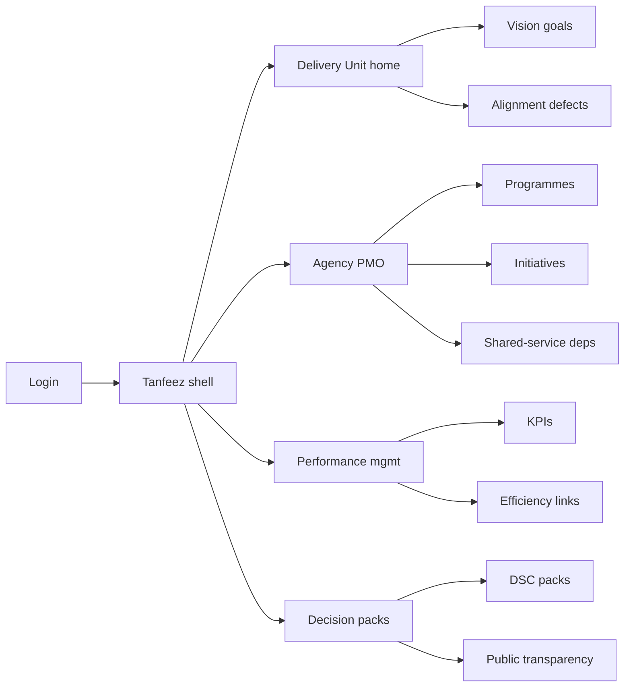
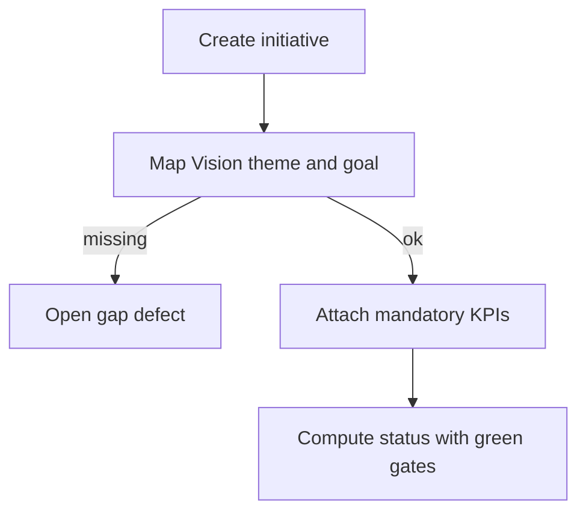
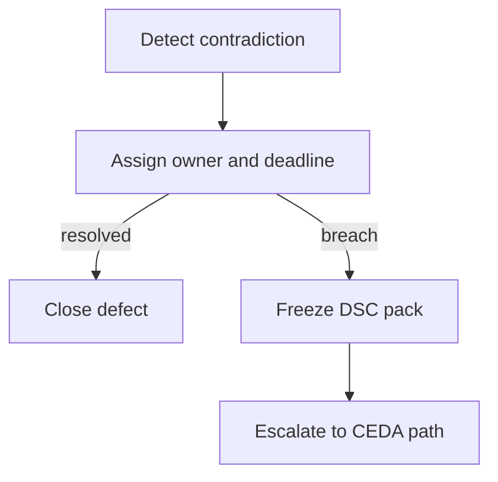

# Tanfeez — Web app

**Product:** [PRODUCT.md](./PRODUCT.md)
**Primary surface:** Vision 2030 delivery alignment console (CEDA Delivery Unit, agency PMO, and performance-management workspaces under one Tanfeez shell)
**Secondary surfaces:** Decision Support Center escalation pack (frozen evidence); public transparency view (non-confidential goals/KPIs only)
**Design thesis:** Tanfeez is an alignment ledger for Vision delivery — not a generic PMO traffic-light wall. The metaphor is a national scoreboard with three defect detectors: gaps (no live initiative on a published goal), duplications (parallel spend), and contradictions (policies that cancel each other). Green is impossible while mandatory KPIs are missing or conflicted. Visual language is deep green and sand-gold on charcoal (Vision gravity without tourism kitsch or purple AI), with coral only for contradictions and escalations. The Tanfeez wordmark sits as a quiet seal on every Decision Support pack and KPI screen.

## UX research synthesis

### Category peers (best-in-class)

- **Delivery Unit / Prime Minister’s Delivery Unit dashboards (UK legacy patterns):** Goal → initiative → KPI with escalation packs. Steal: one-click escalation with frozen evidence; reject vanity green when definitions drift.
- **Saudi Center for Performance Management / Adaa-style agency scorecards:** Agency KPI discipline and comparability. Steal: versioned KPI definitions; reject agency-silo homes that hide cross-ministry contradictions.
- **Clarity / enterprise OKR tools (anti-pattern peer):** Cascading goals UX. Steal: mapping clarity; reject startup OKR aesthetics for sovereign Vision programmes.
- **Shared-services dependency boards (ITIL / ServiceNow business-service maps):** Prerequisite health blocking claimed delivery. Steal: shared-service red blocks initiative green (BR-7).

### Patterns to adopt / reject

- **Adopt:** Mandatory Vision theme + 2030 goal mapping; gap/duplication/contradiction defect types; green blocked on missing/expired/contradicted KPIs; versioned KPI definitions; NTP private-sector and funding tags; Qawam-linked efficiency findings; shared-service dependency model; DSC pack freeze; human-capital KPIs beside infrastructure; public vs confidential views; continuous programme onboarding.
- **Reject:** Traffic-light theatre; silent KPI redefinition; announcement without alignment; purple AI strategy assistants; dashboard-of-everything without defect queue.

### Trust, density, and workflow constraints from PRODUCT.md

Hundreds of initiatives must stay aligned without contradictory policies (wedge). Public openness must not leak fiscal/personnel deliberation (BR-10). Escalation to Royal Court / CEDA needs frozen snapshots (BR-8). New programmes must onboard without schema breakage (BR-11).

## Information architecture

### Nav model

### Roles → default home

| Role | Default home | Why |
|------|--------------|-----|
| CEDA Delivery Unit | Defects queue — gaps/duplications/contradictions | Alignment is the product (BR-1, BR-2) |
| Agency PMO | Initiatives + dependencies | Cannot claim green on red prereqs (BR-3, BR-7) |
| Performance management | KPI definitions and versions | No silent redefine (BR-4) |
| Decision Support officer | Escalation packs | Frozen evidence for CEDA (BR-8) |
| Human-capital programme lead | HC initiatives + competency KPIs | Beside infrastructure (BR-9) |
| Public communications | Public transparency view | Separated confidentiality (BR-10) |

### Cross-links to OpenAPI resources

| Nav area | OpenAPI tags / resources |
|----------|---------------------------|
| Vision themes / 2030 goals | Goals |
| NTP and sibling programmes | Programmes |
| Agency initiatives | Initiatives |
| KPI definitions / status | Kpis |
| Gaps / duplications / contradictions | AlignmentDefects |
| Decision Support packs | DecisionPacks |
| Portfolio / transparency reports | Reporting |

## Screen inventory

### Delivery Unit home

- **Purpose:** Answer “which Vision goals lack live evidence-backed initiatives, and where do policies contradict?”
- **Entry:** Delivery Unit default.
- **Layout regions:** Brand; defect counts by type; unaligned initiative strip; goal coverage %; escalation-ready breaches.
- **Primary actions:** Open defect; escalate to DSC; onboard programme.
- **Empty / loading / error:** Empty defects = coverage healthy with honesty on data lag.
- **BR / story ties:** BR-1, BR-2, BR-12.

### Vision goals map

- **Purpose:** Published 2030 goals/commitments with mapped programmes and initiatives.
- **Entry:** Goals nav; public view (filtered).
- **Layout regions:** Theme tree; goal cards; live initiative count; unaligned flags.
- **Primary actions:** Map initiative; flag unaligned; open KPI.
- **Empty / loading / error:** Goal with zero initiatives = gap defect auto-open.
- **BR / story ties:** BR-1, BR-12.

### Programme and initiative editor

- **Purpose:** Register initiatives under programmes with NTP partnership/funding tags.
- **Entry:** Agency PMO.
- **Layout regions:** Portfolio table; private-sector markers; funding-approach tags; shared-service dependency list; status (green gated).
- **Primary actions:** Create; map goal; link dependency; request status.
- **Empty / loading / error:** Green blocked banner when KPI/defect rules fail.
- **BR / story ties:** BR-3, BR-5, BR-7.

### Alignment defects workspace

- **Purpose:** Record gaps, duplications, contradictions with owners and deadlines.
- **Entry:** Delivery home; alerts.
- **Layout regions:** Defect queue typed; evidence panes; owner/deadline; resolution log.
- **Primary actions:** Assign; resolve; escalate.
- **Empty / loading / error:** Overdue = coral escalate CTA.
- **BR / story ties:** BR-2.

### KPI definition and status

- **Purpose:** Versioned definitions; status cannot go green with missing/expired/contradicted mandatory KPIs.
- **Entry:** Performance home.
- **Layout regions:** Definition version timeline; status grid; contradiction links; expiry clocks.
- **Primary actions:** Amend definition (versioned); update status; block green.
- **Empty / loading / error:** Missing mandatory KPI = initiative status locked non-green.
- **BR / story ties:** BR-3, BR-4.

### Shared-service dependencies

- **Purpose:** Model prerequisites so agency cannot claim delivery while shared service is red.
- **Entry:** Initiative detail; agency home.
- **Layout regions:** Dependency graph; health of shared services; blocking banner.
- **Primary actions:** Link dependency; acknowledge block; notify provider.
- **Empty / loading / error:** Unmodelled critical path warning.
- **BR / story ties:** BR-7.

### Qawam efficiency linkage

- **Purpose:** Connect spending-efficiency findings to initiative outcomes.
- **Entry:** Perf home; initiative.
- **Layout regions:** Review findings list; linked initiatives; outcome vs compliance split.
- **Primary actions:** Link finding; open outcome KPI.
- **Empty / loading / error:** Empty = no linked reviews.
- **BR / story ties:** BR-6.

### Decision Support escalation pack

- **Purpose:** One-click pack from breach with frozen evidence snapshot.
- **Entry:** Defect/breach; Decision home.
- **Layout regions:** Freeze stamp; evidence bundle; recipient (CEDA/Royal Court path); pack history.
- **Primary actions:** Freeze; send; retrieve prior freeze.
- **Empty / loading / error:** Incomplete evidence = warn but allow labelled partial.
- **BR / story ties:** BR-8.

### Human-capital initiative view

- **Purpose:** Headcount and competency KPIs tracked beside infrastructure initiatives.
- **Entry:** HC programme lead.
- **Layout regions:** HC initiative table; competency KPIs; King Salman–class target markers; parity with infra portfolio.
- **Primary actions:** Update HC KPIs; map to Vision goals.
- **Empty / loading / error:** HC as orphan spreadsheet banner if unmapped.
- **BR / story ties:** BR-9.

### Public transparency vs confidential

- **Purpose:** Separable views so openness does not leak protected data.
- **Entry:** Comms; toggle in shell.
- **Layout regions:** Public goal/KPI subset; confidential deliberation pane (role-gated); leak-check on publish.
- **Primary actions:** Publish public extract; audit confidential access.
- **Empty / loading / error:** Attempted confidential field on public = block.
- **BR / story ties:** BR-10.

### Programme onboarding

- **Purpose:** Add new executive programmes without schema breakage.
- **Entry:** Delivery admin.
- **Layout regions:** Onboarding wizard; theme/goal mapping; KPI seed; defect scan.
- **Primary actions:** Onboard; validate; announce internally.
- **Empty / loading / error:** Validation errors inline.
- **BR / story ties:** BR-11.

## Key flows

1. **Map and cover a goal** — register initiative → map theme/goal → attach KPIs → clear defects; failure: unaligned flag.

2. **Contradiction to DSC** — detect contradiction → assign owner → deadline miss → freeze pack → escalate.

3. **Green gate** — check KPIs + defects + shared-service health → allow or block green.

4. **KPI redefinition** — amend definition → new version → series continuity warning.

5. **Public extract** — select publishable fields → leak-check → publish.

## Design system

### Tokens (CSS variables)

- `--color-ink: #F2EFE8` — text on dark
- `--color-charcoal: #141A17` — ground
- `--color-panel: #1C2420` — panels
- `--color-vision: #0E6B4F` — primary / aligned
- `--color-sand: #C4A35A` — attention / NTP tags
- `--color-coral: #D45D4A` — contradiction / escalation
- `--color-amber: #D4A017` — gap / duplication
- `--color-steel: #8A948C` — secondary
- `--color-brand: #D4C4A0` — Tanfeez seal
- `--font-display: "Fraunces", serif` — goal titles
- `--font-body: "IBM Plex Sans", sans-serif`
- `--font-mono: "IBM Plex Mono", monospace` — KPI ids, pack freeze hashes
- `--space-1`…`--space-8`: 4px scale
- `--radius-sm: 4px`; `--radius-md: 8px`
- `--motion-freeze: 180ms ease-out` — DSC freeze stamp
- `--motion-defect: 220ms ease-in-out` — coral contradiction pulse
- `--motion-green-block: 160ms ease-out` — status gate flash
- Atmosphere: subtle geometric lattice (not ornate pattern overload); sand hairlines; no stock desert-hero photography in console.

### Typography & brand

- Display for Vision goal names; mono for freeze ids.
- Brand seal on defects, packs, and public extracts.
- Login: brand hero; headline (“Gaps. Duplications. Contradictions.”); one CTA.

### Do / don’t

- **Do:** Type every defect; block false green; version KPIs; freeze escalations; separate public/confidential.
- **Don’t:** Traffic-light wallpaper; silent KPI edits; purple AI; announce unaligned initiatives as delivery wins.

### Accessibility & domain trust cues

- Status never colour-only — text + icon for green block reasons.
- Live regions for new contradictions and pack freezes.
- Focus: goals → initiatives → defects → pack.
- Confidential fields announced to screen readers as restricted.

## Component patterns

- **VisionGoalMap** — theme → goal → initiatives.
- **AlignmentDefectRow** — gap / duplication / contradiction.
- **GreenGateBanner** — why status cannot be green.
- **KpiVersionTimeline** — definition history.
- **SharedServiceDepGraph** — blocking prerequisites.
- **QawamLinkChip** — efficiency finding ↔ initiative.
- **DscFreezePack** — evidence snapshot.
- **HcKpiParityRow** — human capital beside infra.
- **PublicConfidentialSwitch** — view separation.
- **ProgrammeOnboardWizard** — schema-safe intake.

## Out of scope for v1 web

- Replacing agency ERP/financial systems; citizen services portals; full Adaa replacement outside Vision alignment; Royal Court document management; AI chatbot for ministers.
